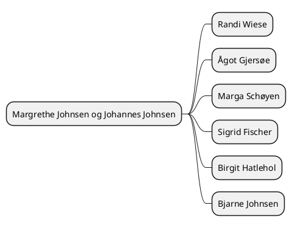

Prøve andre plugins?
* https://github.com/quantorconsulting/mkdocs_build_plantuml
* Direkte integrasjon i markdown
  * [stackoverflow](https://stackoverflow.com/questions/32203610/how-to-integrate-uml-diagrams-into-gitlab-or-github)

## Test

## Johnsen trunk tree

The Johnsen trunk tree.

## direct integration test

### Mindmap Wiese

### class diagram Wiese

Proxy må ta utgangspunkt i en enkel plantuml med include av kildekoden til diagrammet du vil vise 
'''puml
!include https://raw.githubusercontent.com/thomiz/johnsen-family/master/input/images-source/wiese-grenen-mind.puml
'''

#### Source

https://github.com/thomiz/johnsen-family/blob/master/input/images-source/wiese-grenen.plantuml

