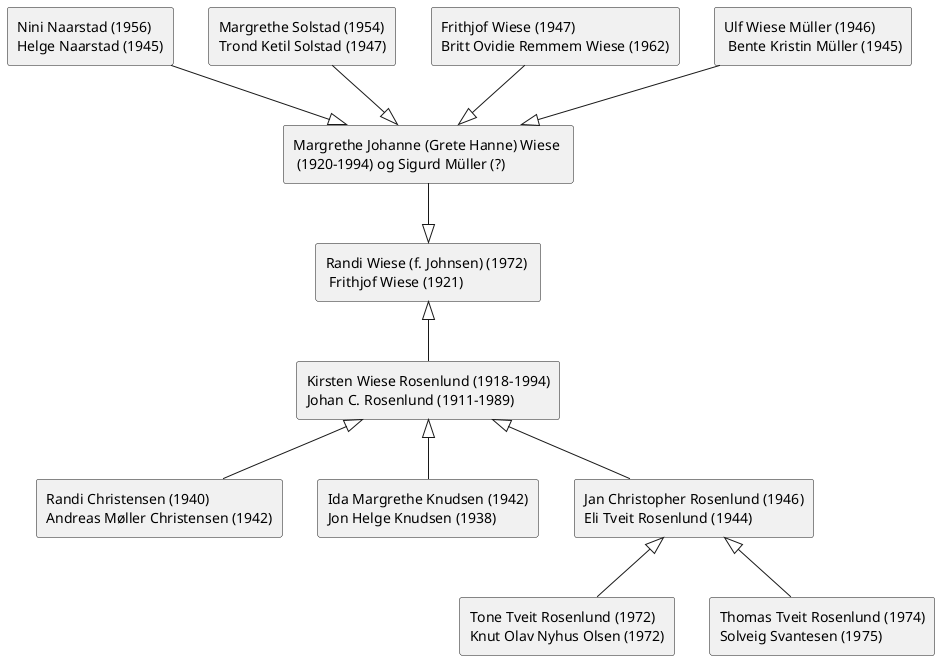

```puml
@startuml
rectangle "Margrethe Johnsen \n Johannes Johnsen" as MJJJ $trunk
rectangle "Randi Wiese (f. Johnsen) (1972) \n Frithjof Wiese (1921)" as RWFW $trunk $wiese
rectangle "Margrethe Johanne (Grete Hanne) Wiese \n (1920-1994) og Sigurd Müller (?)" as MJSM $wiese
rectangle "Ulf Wiese Müller (1946) \n Bente Kristin Müller (1945)" as UWMB $wiese
rectangle "Frithjof Wiese (1947)\nBritt Ovidie Remmem Wiese (1962)" as FWBR $wiese
rectangle "Margrethe Solstad (1954)\nTrond Ketil Solstad (1947)" as MSTK $wiese
rectangle "Nini Naarstad (1956)\nHelge Naarstad (1945)" as NNHN $wiese
rectangle "Kirsten Wiese Rosenlund (1918-1994)\nJohan C. Rosenlund (1911-1989)" as KWRJ $wiese
rectangle "Randi Christensen (1940)\nAndreas Møller Christensen (1942)" as RCAM $wiese
rectangle "Ida Margrethe Knudsen (1942)\nJon Helge Knudsen (1938)" as IMKJ $wiese
rectangle "Jan Christopher Rosenlund (1946)\nEli Tveit Rosenlund (1944)" as JCRE $wiese
rectangle "Tone Tveit Rosenlund (1972)\nKnut Olav Nyhus Olsen (1972)" as TTRK $wiese
rectangle "Thomas Tveit Rosenlund (1974)\nSolveig Svantesen (1975)" as TTRS $wiese

MJJJ <|-- RWFW
RWFW <|-up- MJSM
MJSM <|-up- UWMB
MJSM <|-up- FWBR
MJSM <|-up- MSTK
MJSM <|-up- NNHN

RWFW <|-down- KWRJ
KWRJ <|-- RCAM
KWRJ <|-- IMKJ
KWRJ <|-- JCRE
JCRE <|-- TTRK
JCRE <|-- TTRS

remove *
restore $wiese
@enduml
```
